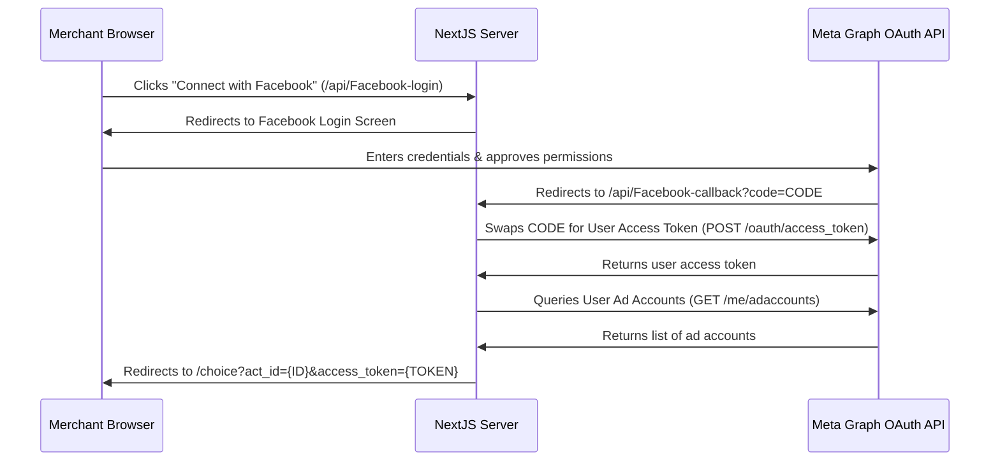
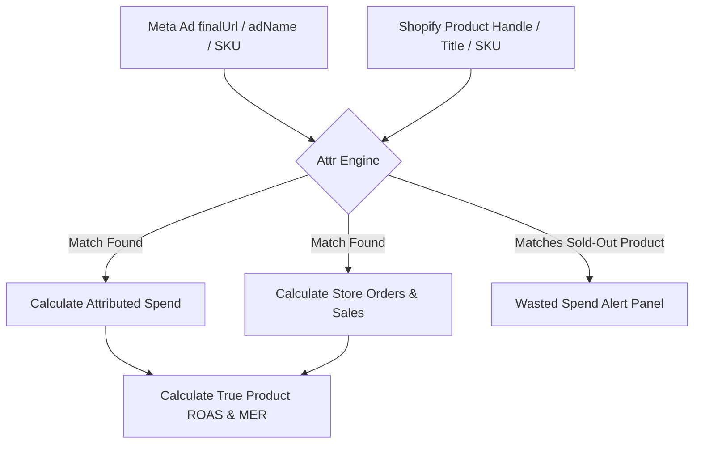

# AdManager Platform Architecture & Flow Guide

This document provides a comprehensive, end-to-end documentation of the AdManager Next.js application, explaining its complete layout, authentication mechanisms, data synchronization, and matching flows.

---

## 1. High-Level Architecture Overview

AdManager is a Next.js (App Router) SaaS application built to aggregate Meta Ads statistics and correlate them with live Shopify store inventory and orders. The app is completely **serverless and database-free**—all merchant credentials and session configurations are persisted directly in the client's browser using `localStorage`.

```
                        ┌─────────────────────────────────┐
                        │      Merchant Web Browser       │
                        └──────┬───────────────────▲──────┘
                               │                   │
                     Facebook  │                   │  API Proxy
                    OAuth Flow │                   │  Requests
                               ▼                   │
                  ┌─────────────────────────────┐  │
                  │   Meta Ads / Shopify APIs   │  │
                  └────────────▲────────────────┘  │
                               │                   │
                               │ Backend           │
                               │ Outbound          │
                               ▼                   │
                    ┌──────────────────────────────┴┐
                    │    Next.js serverless API     │
                    │   (routes: /api/meta, etc.)   │
                    └───────────────────────────────┘
```

---

## 2. Phase 1: Meta Ads Connection & Authentication

AdManager offers two options to retrieve Meta credentials on the **[HomePage](file:///e:/Office%20Projects/admanager/src/app/(pages)/homePage/page.tsx)**:

### Flow A: Facebook OAuth Login (Automatic)



* **Login Endpoint**: **[Facebook-login/route.ts](file:///e:/Office%20Projects/admanager/src/app/api/Facebook-login/route.ts)**
  Constructs the Facebook authorization URI requesting the following scopes:
  * `ads_management`: To modify and read ad sets/ads.
  * `ads_read`: To retrieve analytics.
  * `business_management`: To navigate corporate Business Managers.
  * `pages_read_engagement`: To fetch linked business assets.
* **Callback Endpoint**: **[Facebook-callback/route.ts](file:///e:/Office%20Projects/admanager/src/app/api/Facebook-callback/route.ts)**
  Exchanges the temporary `code` for a long-lived User Access Token. It fetches the default account ID and redirects the merchant to the selection page: `/choice`.

### Flow B: Developer Token Input (Manual)
* For development, testing, or custom accounts, the user enters:
  1. **Ad Account ID** (e.g. `act_123456789`)
  2. **Facebook User Token** (`EAAB...`)
* Clicking "Proceed" bypasses OAuth routes and pushes directly to `/choice/{accountID}?access_token={token}`.

---

## 3. Phase 2: Ad Account Selection (`/choice`)

Once authenticated, the merchant lands on **[choice/page.tsx](file:///e:/Office%20Projects/admanager/src/app/(pages)/choice/page.tsx)**:
* The page triggers a client-side fetch to Meta's endpoint:
  `https://graph.facebook.com/v19.0/me/adaccounts?fields=id,name,account_status&access_token={token}`.
* The merchant is presented with a listing of accounts. Choosing one redirects them to:
  `/choice/{accountID}?access_token={token}`.

---

## 4. Phase 3: Dashboard Assembly (`/choice/[accountID]`)

The folder **[choice/[accountID]/page.tsx](file:///e:/Office%20Projects/admanager/src/app/(pages)/choice/[accountID]/page.tsx)** serves as the main dashboard wrapper. It loads **[MetaDashboard.tsx](file:///e:/Office%20Projects/admanager/src/components/meta/MetaDashboard.tsx)** which initializes two data engines:

### 1. Meta Ads Analytics Engine (`useMetaDashboard.ts`)
Queries the API proxy route `/api/meta` to fetch and parse:
* **Campaigns**: Status, CTR, total budget, cost, and name.
* **Ad Sets**: Target profiles, spend, conversions.
* **Ads & Creatives**: Target URLs (`finalUrl`), copywriting headlines, and creative attachments.
* **Insights**: Attributed sales, impressions, clicks.
* Supports **progressive page loading** (limit 50 per page + cursor pagination) to optimize dashboard speed.

### 2. Shopify E-Commerce Engine (`useShopifyDashboard.ts`)
Manages store synchronization via OAuth redirects or manual Admin API keys (`shpat_...`):
* Fetches Shopify Products (50 items limit with dynamic Link-header pagination).
* Fetches the last 250 orders to attribute revenue and calculate sales quantities.
* Automatically stores credentials in `localStorage` for automatic logins on subsequent visits.

---

## 5. Phase 4: Dynamic Shopify Correlative Analysis

Once both sources (Meta + Shopify) are connected, the dashboard enables advanced features:



### 1. Multi-Tier Product Matching
To link an active Facebook Ad to a Shopify Product listing, the matching engine runs:
* **Level 1: URL Handle Extraction**: Extracts `/products/{handle}` out of the ad's landing page URL (e.g. `finalUrl` or `url_tags`) and checks it against the Shopify Product handle.
* **Level 2: Variant SKU Match**: Searches the ad name for any Shopify Variant SKU code (e.g., `COZY-BLK-MD`).
* **Level 3: Title Match**: Checks if the ad name contains the exact product title.

### 2. Wasted Budget Alerts
If a Meta Ad's effective status is `ACTIVE` and has spend $> 0$, but the matched Shopify Product has **0 total stock** in inventory, it triggers an alert panel. The panel highlights the exact amount of budget wasted driving traffic to a sold-out item.

### 3. Dynamic Currency Localization
1. The app extracts the store currency code from the Shopify orders payload (e.g., `PKR`, `USD`, `EUR`).
2. If Shopify is connected, the app unifies the dashboard currency, formatting both Meta Spend/Revenue and Shopify Revenue values using the browser's dynamic localization formatter:
   ```typescript
   new Intl.NumberFormat('en-US', { style: 'currency', currency: currencyCode })
   ```
3. If a merchant's store is in **PKR**, all dollar values are automatically converted to PKR formats (e.g., **`₨1,365.00`**).

### 4. Side-by-Side Performance Comparison (Double-Row Grid)
* **Single Row Layout (Shopify Disconnected)**: Renders a simple, single row of 6 columns displaying standard Meta Ads data.
* **Double Row Layout (Shopify Connected)**: Automatically splits into two rows of 3 columns (`grid-cols-3`), enlarging the cards to show Meta and Shopify statistics side-by-side:
  * **Spend vs. Shopify Orders**
  * **Clicks vs. Shopify Customers** (Traffic vs. Buyers)
  * **Ad Impressions** (Reach)
  * **Ad Conversions vs. Store Orders**
  * **Ad Revenue vs. Banked Cash Revenue**
  * **Meta ROAS vs. Blended ROAS (MER)** (Total Store Sales $\div$ Total Meta Spend)
